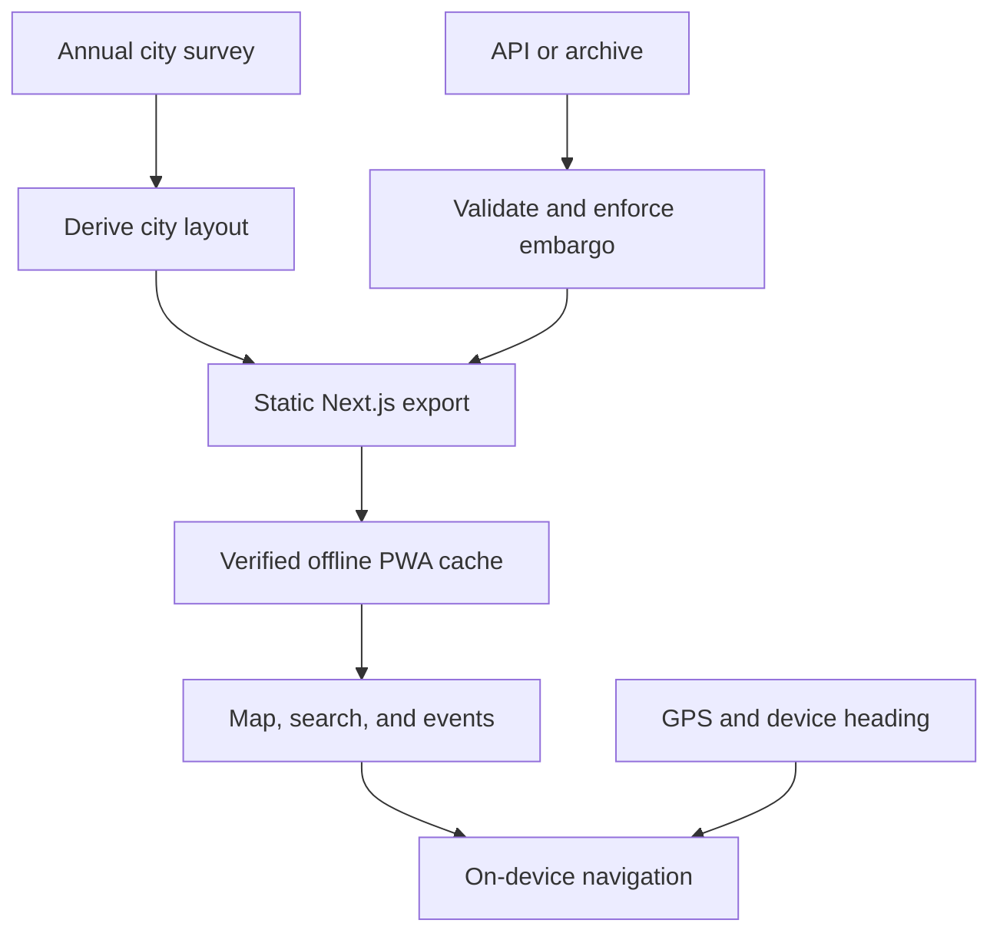

<div align="center">
  

  # Dust Compass

  **An offline-first map, event guide, and compass for Black Rock City.**

  Find camps, art, events, services, and your way home—even when the network disappears.

  [](https://lnorton89.github.io/dustcompass/)
  [](https://github.com/lnorton89/dustcompass/actions/workflows/ci.yml)
  [](https://github.com/lnorton89/dustcompass/actions/workflows/deploy.yml)
  [](LICENSE)
</div>

<a href="https://lnorton89.github.io/dustcompass/">
  
</a>

> [!IMPORTANT]
> Dust Compass is an independent project. It is not affiliated with, endorsed by, or verified by Burning Man Project. Treat all locations as informational and follow posted signs and official instructions on playa.

## Why Dust Compass

Black Rock City is temporary, rotated, rebuilt from a new survey each year, and used in a place where connectivity is unreliable. A normal web map is the wrong tool.

Dust Compass turns Burning Man's published city survey and listing data into a static, installable web app. It needs no account, sends saved places nowhere, uses no tile server, and precaches the working map before you leave coverage.

## Highlights

- **Works offline** — the app shell, map geometry, labels, listings, and service worker are cached up front and verified before the app reports itself ready.
- **Speaks playa addresses** — search `D & 3:15`, `7:30 & Esplanade`, or `12:00 2500'`; tap open playa to reverse-geocode it.
- **Navigates with live GPS** — follow a live location marker, distance, walk/bike estimates, clock direction, and device-heading compass. The screen stays awake during active navigation when the browser supports it.
- **Finds what matters nearby** — jump to the nearest toilet, ranger, or medical point with one tap.
- **Keeps the week organized** — browse events by time or distance, search titles and descriptions, and save a personal offline schedule.
- **Gets you back** — save a camp, tent, bike, meetup point, or dropped pin on the device and navigate to it later.
- **Protects night vision** — switch between dark, light, and a deliberately low-luminance red night mode.
- **Shares useful links** — send a camp, artwork, or exact pin with its playa address and a place-specific social preview.

## Try it

Open **[lnorton89.github.io/dustcompass](https://lnorton89.github.io/dustcompass/)** in a modern browser.

Before heading to playa:

1. Open the app on a reliable connection.
2. Wait for the status indicator to say **Ready offline**.
3. Install it from your browser's **Add to Home Screen** or **Install app** action.
4. Test it once in airplane mode.

Geolocation, compass access, wake lock, and PWA installation depend on browser and device support. HTTPS is required for the service worker and geolocation.

## Local development

### Prerequisites

- Node.js 24 (the version used in CI)
- npm
- A modern browser with WebGL 2

### Quick start with archived data

This path does not require an API key:

```sh
git clone https://github.com/lnorton89/dustcompass.git
cd dustcompass
npm ci
npm run fetch-data -- 2025
npm run fetch-archive -- 2025
NEXT_PUBLIC_DATA_YEAR=2025 npm run dev
```

Open [http://localhost:3000](http://localhost:3000).

### Use current listings

Request a key from the [Burning Man API](https://api.burningman.org/api-key-request/), then export it in the shell that will run the fetch:

```sh
export BURNING_MAN_API_KEY=your-key-here
```

In PowerShell, use `$env:BURNING_MAN_API_KEY = 'your-key-here'` instead.

Fetch the city survey and current listings, then start the app:

```sh
npm run fetch-data -- 2026
npm run fetch-api -- 2026
NEXT_PUBLIC_DATA_YEAR=2026 npm run dev
```

`fetch-data` retrieves the published survey and derives `public/data/<year>/layout.json`. `fetch-api` retrieves camps, art, and events, validates every response, enforces location embargoes before writing client-visible data, and refuses to replace good data with an unrecognized payload.

## Configuration

| Variable | Default | Purpose |
|---|---|---|
| `BURNING_MAN_API_KEY` | — | Server-side key used only by `scripts/fetch-api.mjs`; never shipped to browsers |
| `NEXT_PUBLIC_DATA_YEAR` | `2026` | Data directory the client loads |
| `NEXT_PUBLIC_BASE_PATH` | empty | Deployment subpath, such as `/dustcompass` on GitHub Pages |
| `NEXT_PUBLIC_SITE_URL` | live GitHub Pages URL | Canonical base URL used for metadata and share pages |

## How it works



- **No backend:** Next.js exports a static site to `out/`; all map and navigation logic runs in the browser.
- **No raster tile dependency:** `src/brc/city.ts` builds GeoJSON from the derived layout and MapLibre renders it locally. Optional `pmtiles://` support exists for a static surrounding-desert archive.
- **One source of geographic truth:** street geometry, plazas, civic points, city blocks, toilets, the trash fence, and gate roads originate in the official annual survey.
- **Atomic live-data updates:** the service worker promotes a complete revision only after every file is present, so a failed refresh does not replace a working offline dataset with a partial one.
- **Local-first personal data:** favorites, saved places, and saved events remain in browser storage; saved places and events are scoped to the selected data year.

<details>
<summary><strong>Engineering notes: survey fitting, coordinates, and geocoding</strong></summary>

### The city is generated, not downloaded

Black Rock City does not exist as a stable street network. `scripts/derive-layout.mjs` fits the annual survey's annular street centerlines to recover the Man, city rotation, street radii, radial extents, widths, segments, and gate-road geometry. It rejects layouts that disagree with independent surveyed control points instead of quietly publishing plausible-looking geometry.

### Local WGS84 math matters

At Black Rock City's latitude, a mean-radius sphere can introduce several metres of position error over playa distances. `src/brc/geo.ts` uses local WGS84 radii of curvature, preserving the speed of local planar calculations while tracking surveyed and geodesic positions closely enough for street-level use.

### Playa addresses are polar

`src/brc/geocode.ts` converts clock position and distance from the Man into coordinates, parses real address forms used in the published data, and performs the reverse operation for tapped or live GPS positions. It validates intersections against surveyed street segments and radial extents rather than inventing roads through known gaps.

</details>

<details>
<summary><strong>Engineering notes: offline behavior and share pages</strong></summary>

### Offline is a tested product state

The generated service worker precaches the complete application rather than filling the cache opportunistically. Returning sessions verify cache integrity; incomplete caches are repaired, and a refresh is promoted atomically. `scripts/offline-test.mjs` then disables the network, reloads the production build, and requires the map and geocoder to keep working.

### Share pages remain lightweight

Each listing has a static `/p/<uid>/` page with place-specific metadata. `metaplate` generates the main social image, while listing share cards are generated at build time. Crawler-only pages and cards stay outside the offline precache so they do not inflate the first-run download.

</details>

## Project map

| Path | Responsibility |
|---|---|
| `src/brc/` | Survey-derived city model, coordinates, geocoding, travel math, and civic services |
| `src/data/` | Listing ingestion, embargo enforcement, deep links, GPS, favorites, and saved data |
| `src/map/` | MapLibre scene, layers, markers, picking, routes, and styling |
| `src/ui/` | Search, events, details, navigation, filters, offline status, and themes |
| `scripts/` | Data fetches, layout derivation, static assets, service worker, and browser tests |
| `src/app/` | Next.js static routes, metadata, PWA manifest, and listing share pages |

## Testing

The repository checks logic, the real exported application, accessibility, UI invariants, and offline behavior.

```sh
npm run typecheck
npm run lint
npm test
```

For the production browser suites — this is the real production build, not a
separate test-instrumented one:

```sh
NEXT_PUBLIC_BASE_PATH=/dustcompass npm run build
NEXT_PUBLIC_BASE_PATH=/dustcompass npm run preview &

npm run test:smoke -- http://127.0.0.1:4173/dustcompass/
npm run test:a11y -- http://127.0.0.1:4173/dustcompass/
npm run test:ui -- http://127.0.0.1:4173/dustcompass/
npm run test:offline -- http://127.0.0.1:4173/dustcompass/
```

- **Unit and component tests** cover geocoding, survey fidelity, embargo handling, events, saved data, navigation, map layers, and UI behavior.
- **Smoke tests** exercise the production map and core workflows in Chromium.
- **Accessibility tests** run axe against desktop, phone, dialogs, navigation, events, and all color modes.
- **UI invariants** enforce touch-target, overlap, responsive-layout, and production-theme contracts.
- **Offline tests** cut the network after installation and verify the exported app still boots and geocodes.

## Deployment

Pushing to `master` runs the GitHub Pages workflow in `.github/workflows/deploy.yml`. The workflow fetches current data, builds one production `out/` artifact, runs smoke, accessibility, UI-invariant, and offline browser suites against that exact artifact using the runtime-only test hook, and uploads the same unchanged `out/` to Pages.

To deploy at a root domain on another static host:

```sh
npm run fetch-data -- 2026
NEXT_PUBLIC_BASE_PATH= npm run build
```

Publish the resulting `out/` directory over HTTPS. For a project subpath, set `NEXT_PUBLIC_BASE_PATH` to that prefix before building.

## Data, embargoes, and attribution

City geometry comes from [Burning Man's annual GIS survey](https://github.com/burningmantech/innovate-GIS-data). Camps, art, and events come from the [Burning Man public API](https://innovate.burningman.org/apis-page/) or the official [dataset archive](https://innovate.burningman.org/dataset/) for completed years.

Current-year location data is subject to the [API and dataset terms](https://innovate.burningman.org/terms-of-service-for-burning-man-apis-and-datasets/). The fetch pipeline strips embargoed coordinates and geocodable address strings before they can enter `public/`; the client repeats the check as defense in depth.

The bundled offline map glyphs are Open Sans SDF ranges from [openmaptiles/fonts](https://github.com/openmaptiles/fonts), provided under Apache-2.0. Other brand and generated assets in this repository are original to Dust Compass.

## Contributing

Bug reports and focused pull requests are welcome. Before opening a PR:

1. Run `npm run typecheck`, `npm run lint`, and `npm test`.
2. Run the relevant production browser suite for user-facing changes.
3. Keep geographic claims traceable to the official survey or listing source.
4. Do not commit API keys, fetched embargoed locations, generated `out/` files, or local screenshots.

Use [GitHub Issues](https://github.com/lnorton89/dustcompass/issues) for reproducible bugs and feature requests.

## Community

- Read [CONTRIBUTING.md](CONTRIBUTING.md) before opening a pull request.
- Report security vulnerabilities privately according to [SECURITY.md](SECURITY.md).
- Help keep the project welcoming by following the [Code of Conduct](CODE_OF_CONDUCT.md).
- Find ways to get help in [SUPPORT.md](SUPPORT.md).

## License

Dust Compass source code and project-owned assets are released under the [MIT License](LICENSE). Burning Man Event Data, survey data, trademarks, and third-party assets are not relicensed by this repository; their respective terms still apply. See [Data, embargoes, and attribution](#data-embargoes-and-attribution).

---

<div align="center">
  Built for the playa, where “works offline” has to mean it.
</div>
